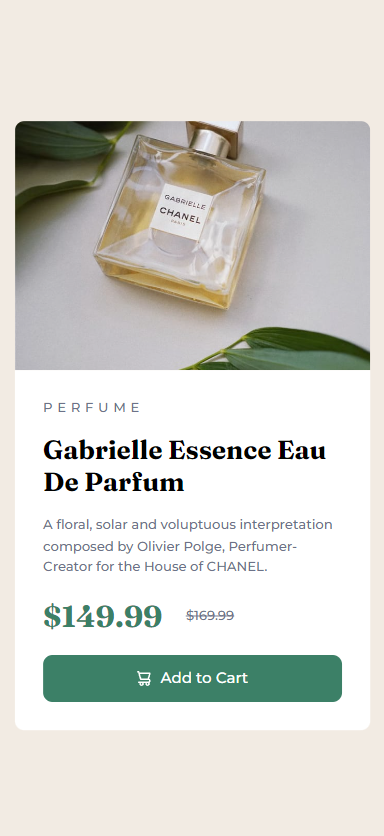

# Frontend Mentor - Product preview card component solution

This is a solution to the [Product preview card component challenge on Frontend Mentor](https://www.frontendmentor.io/challenges/product-preview-card-component-GO7UmttRfa).

## Table of contents

- [Overview](#overview)
  - [The challenge](#the-challenge)
  - [Screenshot](#screenshot)
- [My process](#my-process)
  - [Built with](#built-with)
  - [What I learned](#what-i-learned)
- [Author](#author)

## Overview

### The challenge

Users should be able to:

- View the optimal layout depending on their device's screen size
- See hover and focus states for interactive elements

### Screenshot

<br/>


## My process

### Built with

- Semantic HTML5 markup
- SASS
- Flexbox
- Desktop-first workflow

### What I learned

Use this section to recap over some of your major learnings while working through this project. Writing these out and providing code samples of areas you want to highlight is a great way to reinforce your own knowledge.

- How to install and configure SASS
- How to break up the SASS code into multiple files instead of one giant one
- How to switch images based on viewport size without using Javascript
  - This method isn't supported by Internet Explorer and older versions of major browsers, but was a good enough solution for the scope of this project. Using a Javascript-based solution would help increase browser compatibility
```html
<picture>
  <source
    media="(min-width: 621px)"
    srcset="images/image-product-desktop.jpg"
  />
  <source
    media="(max-width: 610px)"
    srcset="images/image-product-mobile.jpg"
  />
  
</picture>
```
- Applying a `box-sizing: border-box;` CSS property helps remove additional padding/margins added to boxes by the browser

## Author

- [Jaytee Padilla](https://jayteepadilla.dev/)
